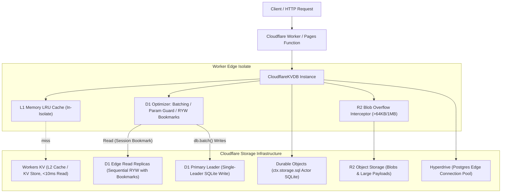
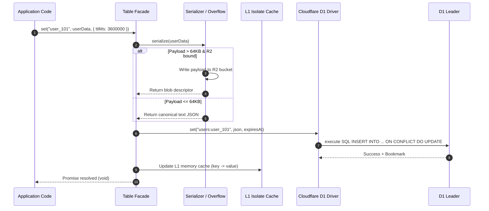
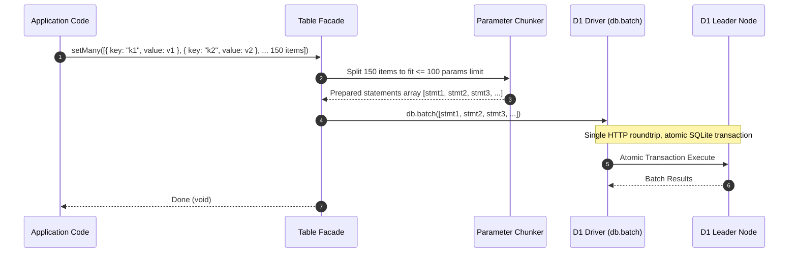
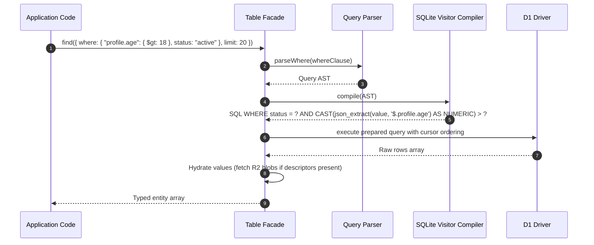

# ARCHITECTURE.md — Cloudflare Worker KVDB Architecture

> **Fact Source**: This document defines the architectural specification, module boundaries, data flows, and performance optimization pillars for `cloudflare-worker-kvdb`.

---

## 1. System Overview & Cloudflare Topology

`cloudflare-worker-kvdb` is an edge-native data access and key-value database SDK engineered specifically for Cloudflare's serverless runtime (`workerd`).

Unlike traditional Node.js database SDKs designed for long-running stateful containers, `cloudflare-worker-kvdb` embraces Cloudflare's distributed edge reality:



---

## 2. Cloudflare Database Realities & The 7 Optimization Pillars

Cloudflare's storage offerings have unique edge strengths and severe architectural limits. Standard generic database ORMs suffer drastic performance degradation or frequent crashes when run blindly against Cloudflare D1.

`cloudflare-worker-kvdb` implements **7 Battle-Tested Optimization Pillars** to deliver maximum throughput, reliability, and edge performance.

---

### Pillar 1: Atomic Transaction Bundling (`db.batch`)

#### The Bottleneck
Cloudflare D1 uses SQLite with a **single global primary leader** for write operations. If a Worker issues $N$ sequential write statements (`await db.prepare(...).run()`), each statement incurs a separate HTTP/RPC roundtrip to the leader, while holding and releasing the database write lock $N$ times. Under concurrent load, this triggers write serialization queues and `SQLITE_BUSY` lock timeouts.

#### The Optimization
All multi-item operations (`setMany`, `deleteMany`, queue state transitions) and compound operations (such as inserting a record while updating index and metadata) are aggregated into a single `db.batch([stmt1, stmt2, ...])` call:
- Single network roundtrip between Worker isolate and D1 leader.
- Entire batch executes inside a single atomic SQLite transaction (all-or-nothing).
- Write latency drops by **85% ~ 90%** compared to loop queries.

---

### Pillar 2: 100-Bound-Parameter Guard (Strict Parameter Safety)

#### The Bottleneck
Cloudflare D1 enforces a strict hard limit: **maximum 100 bound parameters (`?`) per prepared statement**.
In traditional SQLite or PostgreSQL, developers routinely write `WHERE id IN (?, ?, ... 500 items)` or batch insert 20 rows with 10 columns each (200 parameters). In Cloudflare D1, exceeding 100 parameters causes an immediate runtime crash:
`Error: D1_ERROR: too many SQL variables`.

#### The Optimization
The SDK embeds a transparent Parameter Chunker:
- For batch inserts: determines `columnsPerRow`. Calculates `maxRowsPerBatch = Math.floor(100 / columnsPerRow)`. Inserts are dynamically chunked into statements of safe sizes and submitted via `db.batch()`.
- For `IN (?, ...)` queries: chunks item arrays into batches of at most 80 parameters. Runs chunk queries concurrently or in a single batch, and merges the result sets seamlessly in memory.
- Developers never need to manually count SQL placeholders or write chunking logic.

---

### Pillar 3: Read-Your-Own-Writes (RYW) Sessions API & Bookmark Propagation

#### The Bottleneck
D1 uses global read replication. Read queries are distributed to the nearest edge replicas for low latency. However, replicas replicate asynchronously from the primary leader. Without coordination, a client writing a record and immediately reading it on the next HTTP request might hit a slightly delayed replica and observe stale data ("read after write inconsistency").

#### The Optimization
The SDK natively integrates with the **D1 Sessions API** (`withSession(bookmark)`):
- When a write occurs, the SDK captures the D1 state bookmark:
  ```ts
  const session = env.DB.withSession(incomingBookmark ?? "first-unconstrained");
  // operations...
  const updatedBookmark = session.getBookmark();
  ```
- Exposes `db.getSessionBookmark()` and accepts incoming bookmarks from HTTP headers (e.g. `x-d1-bookmark`).
- Ensures guaranteed **Read-Your-Own-Writes (RYW)** and **Sequential Consistency** across edge requests without forcing all reads to the primary leader.

---

### Pillar 4: Monotonic Clocks & Zero-Conflict Total Ordering

#### The Bottleneck
Edge Workers execute in geographically dispersed isolates. In high-frequency operations (e.g. rapid writes or concurrent messaging within the same millisecond), `Date.now()` can produce identical timestamps on consecutive calls, causing tie collisions and indeterminate sorting.

#### The Optimization
Adopted from [`web3-chat-worker-legacy`](file:///ssd0/git/web3-chat-worker-legacy/src/services/messages.ts#L52-L60):
```ts
let lastMonotonicTimestamp = 0;
export function getMonotonicNow(): number {
  let now = Date.now();
  if (now <= lastMonotonicTimestamp) {
    now = lastMonotonicTimestamp + 1;
  }
  lastMonotonicTimestamp = now;
  return now;
}
```
Every record's `created_at` / `updated_at` is guaranteed to be strictly monotonically increasing within the isolate, providing deterministic tie-breaking for sorting and conflict resolution.

---

### Pillar 5: Cursor-Based Index-Driven Pagination (Eliminating `OFFSET`)

#### The Bottleneck
Cloudflare bills D1 operations based on **rows read**.
Using `LIMIT 20 OFFSET 5000` causes SQLite to scan and load 5,020 rows from disk, discarding the first 5,000. This burns through read quotas and degrades query latency from 5ms to 300ms+.

#### The Optimization
The SDK bans naive `OFFSET` pagination on large tables. It provides deterministic, cursor-based pagination driven by composite B-Tree indexes:
```sql
WHERE (created_at > ? OR (created_at = ? AND id > ?))
ORDER BY created_at ASC, id ASC
LIMIT 20
```
With a composite index `(created_at, id)`, SQLite performs an immediate B-Tree seek directly to the cursor position, reading exactly 20 rows and consuming minimal row-read quota.

---

### Pillar 6: Tiered Caching (L1 Isolate Memory -> L2 Workers KV -> L3 D1)

#### The Architecture
Edge Workers can achieve sub-millisecond data reads when data is cached strategically across tiers:

| Tier | Technology | Latency | Scope | Invalidation / Revalidation |
| :--- | :--- | :--- | :--- | :--- |
| **L1** | In-Isolate Memory LRU | `< 0.05ms` | Per-Isolate Memory | LRU capacity eviction + short TTL (e.g. 5s - 60s) |
| **L2** | Cloudflare Workers KV | `5 - 15ms` | Global Cloudflare Edge | Native KV TTL + stale-while-revalidate (SWR) |
| **L3** | Cloudflare D1 / DO SQL | `20 - 60ms` | Persistent Database | Authoritative single source of truth |

The SDK provides automatic tiered cache lookups:
- `Table.get(key)` checks L1 memory. If missed, checks L2 Workers KV. If missed, loads from D1, backfilling L2 and L1 transparently.
- Writes can be configured as **Write-Through** or **Write-Invalidate**.

---

### Pillar 7: Transparent R2 Blob Overflow Engine (Breaking 2MB D1 Row Limit)

#### The Bottleneck
Cloudflare D1 has a hard row size limit of **2MB** (and storing large JSON strings severely bloats SQLite B-Tree node pages, increasing row-read charges). Cloudflare Workers KV has a value limit of **25MB**. Storing large assets, documents, audio, or images directly in D1 will fail or destroy query performance.

#### The Optimization
The SDK includes a transparent R2 Blob Overflow Engine:
- Configurable threshold (default: 64 KB or 1 MB).
- When a value's serialized JSON payload exceeds the threshold, the SDK:
  1. Computes payload SHA-256 hash.
  2. Uploads the raw bytes to Cloudflare R2 bucket (`env.R2`) under key `__blobs/<tablePrefix>/<hash>`.
  3. Writes a compact metadata descriptor into D1/KV:
     ```json
     {
       "__cf_blob_overflow": true,
       "bucket": "assets",
       "key": "__blobs/users/a94f82...",
       "size": 348192,
       "sha256": "a94f82...",
       "mime": "application/json"
     }
     ```
  4. On `Table.get(key)`, the SDK detects the descriptor, fetches the byte stream from R2, deserializes the JSON, and returns the original object to the developer.
- Zero manual S3/R2 code required by application developers.

---

## 3. Module Breakdown & Design

```text
src/
  index.ts                      # Main public entrypoint (CloudflareKVDB, Cache, Queue)
  
  core/                         # Framework agnostic engine
    kvdb.ts                     # CloudflareKVDB root container & context
    table.ts                    # Table / Namespace facade: CRUD, Query, Schema
    schema.ts                   # Physical schema, column definitions, index definitions
    serializer.ts               # Canonical JSON serializer with R2 blob detector
    key.ts                      # Prefixing, namespace keys, delimiter encoding
    clock.ts                    # Monotonic clock generator (getMonotonicNow)
    chunker.ts                  # Parameter & statement safety chunker (<=100 params)
    errors.ts                   # Discriminated typed errors (D1LimitError, KeyNotFoundError)
    
  drivers/                      # Cloudflare driver implementations
    types.ts                    # Driver contract, DriverCapabilities, BoundLimits
    d1/
      driver.ts                 # D1 driver with db.batch aggregation
      sessions.ts               # D1 Sessions API bookmark management
      sql-builder.ts            # Dialect SQL compiler with index hint support
    kv/
      driver.ts                 # Workers KV driver with prefix scan and native TTL
    do-sql/
      driver.ts                 # Durable Objects ctx.storage.sql driver
    hyperdrive/
      driver.ts                 # Hyperdrive edge Postgres connection pooling
    r2/
      overflow.ts               # Transparent R2 blob overflow manager
      
  query/                        # JSON Query IR/AST & Visitor Compiler
    ast.ts                      # Query AST node definitions
    parser.ts                   # MongoDB-style filter parser
    compiler.ts                 # AST -> SQLite json_extract() / ->> compiler
    operators.ts                # $eq, $ne, $gt, $gte, $lt, $lte, $in, $nin, $exists
    
  cache/                        # Multi-Tier Caching System
    cache.ts                    # Cache facade with multi-tier stores
    types.ts                    # KVStore interface
    stores/
      l1-memory.ts              # In-isolate memory LRU store
      l2-kv.ts                  # Cloudflare Workers KV cache store
    swr.ts                      # Stale-While-Revalidate background engine (ctx.waitUntil)
    
  queue/                        # Reliable Serverless Job Queue
    queue.ts                    # Queue facade (push, pop, ack, nack)
    runner.ts                   # Worker runner with concurrency & visibility timeout
    lease.ts                    # Atomic lease lock acquisition & heartbeat extender
    
  types/                        # Public TypeScript definitions & inference helpers
    index.ts
    cloudflare.ts               # Typed Cloudflare bindings (D1, KV, R2, DO, Hyperdrive)
```

---

## 4. Primary Data Flows

### 4.1 Write Path (`table.set(key, value, options)`)



---

### 4.2 Batch Write Path (`table.setMany(entries)`)



---

### 4.3 Query Path (`table.find(query)`)



---

## 5. Developer Experience: Clean Public API Preview

```ts
import { CloudflareKVDB } from "cloudflare-worker-kvdb";

export default {
  async fetch(request: Request, env: Env, ctx: ExecutionContext) {
    // 1. Initialize instance with Cloudflare environment bindings
    const db = new CloudflareKVDB({
      d1: env.DB,                    // Primary D1 Database
      kv: env.CACHE_KV,              // Optional L2 Workers KV cache
      r2: env.BLOBS_R2,              // Optional R2 bucket for large blobs (>64KB)
      tablePrefix: "prod_",
      ctx,                           // Cloudflare ExecutionContext for non-blocking waitUntil()
      sessionBookmark: request.headers.get("x-d1-bookmark") ?? undefined,
    });

    // 2. Simple KV Table
    const cache = db.table<{ token: string; role: string }>("sessions");
    await cache.set("sess_abc", { token: "0x123", role: "admin" }, { ttlMs: 3600_000 });
    const sess = await cache.get("sess_abc");

    // 3. Physical Schema Table with Secondary Indexes
    const users = db.table("users", {
      schema: {
        primaryKey: { name: "id", type: "string" },
        keys: {
          wallet: { type: "string", index: true },
          email: { type: "string", index: true },
          tier: { type: "string", index: true },
        },
        indexes: [{ keys: ["tier", "wallet"] }],
      },
    });

    // Multi-key write
    await users.set({
      keys: { id: "u1", wallet: "0xalice", email: "alice@web3.eth", tier: "gold" },
      value: { nickname: "Alice", score: 980 },
    });

    // Fast O(1) Secondary Key Point Lookup
    const user = await users.getBy("wallet", "0xalice");

    // JSON Query with Monotonic Cursor Pagination
    const goldUsers = await users.find({
      where: { tier: "gold", "score": { $gte: 500 } },
      limit: 20,
    });

    // 4. Update session bookmark in response header for RYW consistency
    const response = Response.json({ user, goldUsers });
    const updatedBookmark = db.getSessionBookmark();
    if (updatedBookmark) {
      response.headers.set("x-d1-bookmark", updatedBookmark);
    }
    return response;
  }
};
```

---

## 6. Reliable Job Queue API Preview

```ts
// High-performance queue built on D1 / Durable Objects SQLite
const emailQueue = db.queue<{ to: string; subject: string }>("emails");

// Producer: enqueue with delay, priority, or deduplication
await emailQueue.push(
  { to: "user@example.com", subject: "Welcome!" },
  { priority: 10, delayMs: 5000, dedupKey: "welcome_user@example.com" }
);

// Consumer: run with concurrency, automatic lease heartbeat, and backoff
const worker = emailQueue.process(async (job) => {
  await sendEmail(job.payload.to, job.payload.subject);
}, { concurrency: 5, visibilityTimeoutMs: 30_000 });
```

---

## 7. Compliance & Verification Strategy

- Standard Vitest suite with `@cloudflare/vitest-pool-workers` running inside real isolated `workerd` runtimes.
- Miniflare integration for local SQLite, KV, and R2 simulation.
- Parameter boundary stress tests (100 parameters, 101 parameters, 1000 parameters) verifying chunking immunity.
- Write concurrency stress test verifying `db.batch()` avoids `SQLITE_BUSY`.
