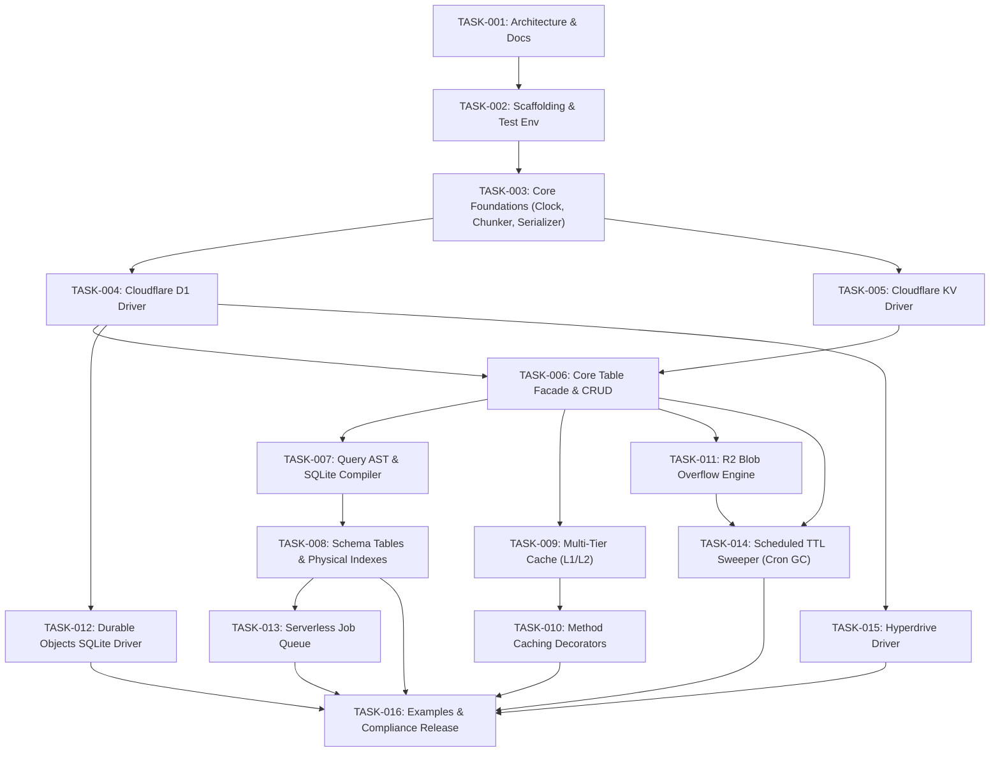

# TASK_INDEX.md — Task Index & Roadmap

This document catalogs all engineering tasks for `cloudflare-worker-kvdb`. Each task follows the strict rules in [`docs/AI_AGENT_PROMPT.md`](file:///ssd0/git/cloudlflare-worker-kvdb/docs/AI_AGENT_PROMPT.md).

---

## Complete Task Matrix (16 Tasks)

| Task ID | Title | Dependencies | Status | Est. Time | Key Deliverable |
| :--- | :--- | :--- | :--- | :--- | :--- |
| [TASK-001](file:///ssd0/git/cloudlflare-worker-kvdb/docs/AI/tasks/TASK-001.md) | Architecture Spec, Cloudflare DB Research & Doc Framework | None | **DONE** | 60 min | Full AI governance & architecture docs |
| [TASK-002](file:///ssd0/git/cloudlflare-worker-kvdb/docs/AI/tasks/TASK-002.md) | Project Scaffolding, Package Config & Vitest Workers Pool | TASK-001 | **DONE** | 45 min | `package.json`, `tsconfig.json`, Miniflare test harness |
| [TASK-003](file:///ssd0/git/cloudlflare-worker-kvdb/docs/AI/tasks/TASK-003.md) | Core Foundations: Clock, Chunker, Key Encoder & Serializer | TASK-002 | **DONE** | 60 min | Monotonic clock, 100-param safety chunker, serializer |
| [TASK-004](file:///ssd0/git/cloudlflare-worker-kvdb/docs/AI/tasks/TASK-004.md) | Cloudflare D1 Driver with `db.batch()` & Sessions API | TASK-003 | **DONE** | 60 min | Atomic batching, parameter guard, RYW bookmarks |
| [TASK-005](file:///ssd0/git/cloudlflare-worker-kvdb/docs/AI/tasks/TASK-005.md) | Cloudflare Workers KV Driver with TTL & Prefix Listing | TASK-003 | **DONE** | 45 min | Fast edge reads, native TTL, prefix cursor scan |
| [TASK-006](file:///ssd0/git/cloudlflare-worker-kvdb/docs/AI/tasks/TASK-006.md) | Core Table Facade & High-Throughput CRUD Operations | TASK-004, TASK-005 | **DONE** | 60 min | `db.table()`, namespace routing, batch CRUD |
| [TASK-007](file:///ssd0/git/cloudlflare-worker-kvdb/docs/AI/tasks/TASK-007.md) | Mongo-Style Query AST & SQLite `json_extract` Compiler | TASK-006 | **DONE** | 60 min | AST parser & compiler for SQLite `json_extract()` |
| [TASK-008](file:///ssd0/git/cloudlflare-worker-kvdb/docs/AI/tasks/TASK-008.md) | Schema Tables, Multi-Keys & Native Physical B-Tree Indexes | TASK-007 | **DONE** | 60 min | Physical column schema, secondary keys, dynamic addKey |
| [TASK-009](file:///ssd0/git/cloudlflare-worker-kvdb/docs/AI/tasks/TASK-009.md) | Multi-Tier Caching System (L1 Memory + L2 KV + `waitUntil`) | TASK-006 | **DONE** | 60 min | L1 Memory (<0.05ms) -> L2 KV (10ms) -> L3 D1 + SWR |
| [TASK-010](file:///ssd0/git/cloudlflare-worker-kvdb/docs/AI/tasks/TASK-010.md) | Method Caching Decorators (`@Cacheable`, `@CacheClear`) | TASK-009 | **DONE** | 45 min | TC39 decorators for caching Worker / DO methods |
| [TASK-011](file:///ssd0/git/cloudlflare-worker-kvdb/docs/AI/tasks/TASK-011.md) | Transparent Cloudflare R2 Blob Overflow Engine | TASK-006 | **DONE** | 45 min | Overcomes D1 2MB row limit with transparent R2 storage |
| [TASK-012](file:///ssd0/git/cloudlflare-worker-kvdb/docs/AI/tasks/TASK-012.md) | Cloudflare Durable Objects SQLite Driver (`ctx.storage.sql`) | TASK-004 | **DONE** | 45 min | Low-latency in-actor transactional SQLite storage |
| [TASK-013](file:///ssd0/git/cloudlflare-worker-kvdb/docs/AI/tasks/TASK-013.md) | Serverless Reliable Job Queue on D1 / DO SQLite | TASK-008 | **DONE** | 60 min | Leases, visibility timeout, backoff, and DLQ |
| [TASK-014](file:///ssd0/git/cloudlflare-worker-kvdb/docs/AI/tasks/TASK-014.md) | Scheduled TTL Sweeper & Vacuum Engine (Cron GC & Blobs) | TASK-006, TASK-011 | **DONE** | 45 min | Worker Cron Trigger (`* * * * *`) garbage collection |
| [TASK-015](file:///ssd0/git/cloudlflare-worker-kvdb/docs/AI/tasks/TASK-015.md) | Cloudflare Hyperdrive Postgres Driver Integration | TASK-004 | **DONE** | 45 min | Edge-accelerated connection pooling for Postgres |
| [TASK-016](file:///ssd0/git/cloudlflare-worker-kvdb/docs/AI/tasks/TASK-016.md) | Production Examples & Full Compliance Suite Verification | All | **DONE** | 60 min | Worker, Durable Objects, Cron examples & release docs |

---

## Detailed Dependency Graph

